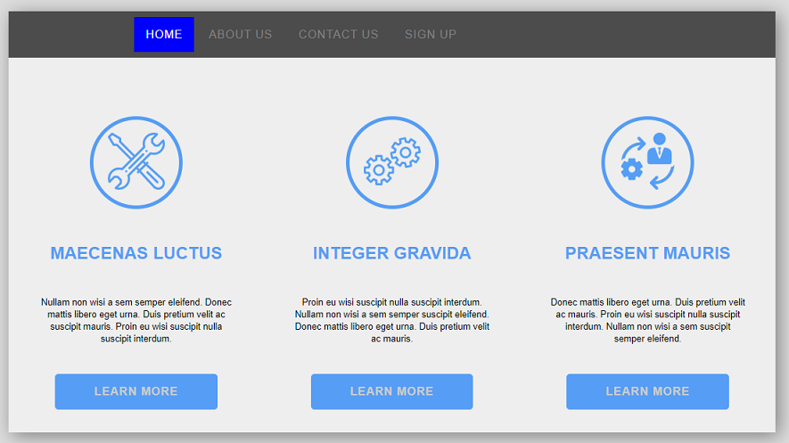

## Exercise-Html-Flex-1

### Objective 
Purpose of this assignment is to improve your web designing skills and use flex layout to create good looking and interactive  web pages
In order to meet this objective you are suggested to create a one page website to display product details, using Html 5 Semantic Elemments and CSS.

### AESTHETICS:
The intent behind following these aesthetics is to make the web page more visually appealing.

1. Page must have a Header with Navbar, and there should be some spacing in all corners of the page.
2. Navbar must have HOME , ABOUT US , CONTACT US , SIGN UP links , aligned as flex row.
3. On hover of the navbar elements background colour should change to blue.
4. The Main section of the page is adviced to have three  article elements (use css class name product ) arranged in flex row inside a section (css class name products-section) to display product details.
5. Each article must have a product image (inside a div tag with css class product-image) , product name(inside h2 tag with css class product-title), a brief description (inside p tag with css class product-description) about the product and  Learn More link in a linear manner.
6. All content inside article should be centre aligned
 
### CODING GUIDELINES:

 - All html tags and css class names must in lowercase
 - The project repository must have a README.md describing about the project being done.
 - The project is suggested to have a descriptive folder structure.
 - The HTML code should adhere to W3C guidelines. Tags are closed, required attributes used, nothing deprecated, etc.
 - The code should make use of Meta Tags in narrating additional information like author and description of the page.
 - Comments should be included for things that may not be immediately obvious upon reviewing the code.
 - Two Space indentation must be followed while coding your page.
 - Usage of classes for elements which needs similar styling must be maximized.
 - Usage of Inline CSS must be eliminated.
 - Usage of External Stylesheet is recommended.
 
 
## Sample Page For Your Reference

## MENTORS TO BEGIN REVIEW YOUR WORK ONLY AFTER ->

<kbd>⌘</kbd> You add the respective Mentor as a Reporter/Master into your Assignment Repository

### REFERENCES:

<kbd>⇥</kbd> https://www.w3.org/Style/Examples/011/firstcss.en.html  
<kbd>⇥</kbd> https://www.w3schools.com/html

### NOTE:
Avoid using any third-party plugins.
