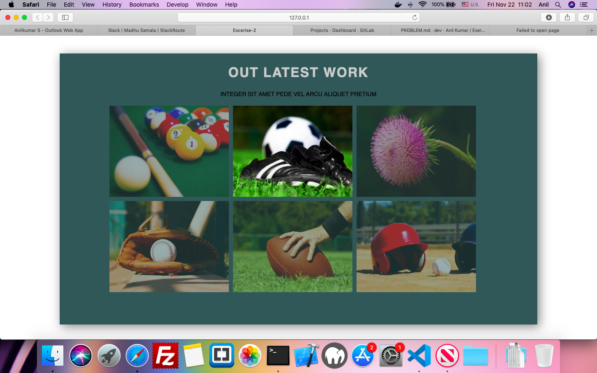

## Exercise-Html-Flex-2

### Objective 
Purpose of this assignment is to improve your web designing skills and use flex layout to create good looking and interactive  web pages.
In order to meet this objective you are suggested to create a one page website to display some images, using Html 5 Semantic Elemments and CSS.

### AESTHETICS:
The intent behind following these aesthetics is to make the web page more visually appealing.

1. Create a page to display images as tiles arranged in rows.
2. Each row should have only three tiles.
3. Initially image opacity should be 50%.
4. On hover of the image opacity should be 100%.
5. All content inside page should be centre aligned
 
### CODING GUIDELINES:

 - The project repository must have a README.md describing about the project being done.
 - The project is suggested to have a descriptive folder structure.
 - Images used should be taken from images folder.
 - The HTML code should adhere to W3C guidelines. Tags are closed, required attributes used, nothing deprecated, etc.
 - The code should make use of Meta Tags in narrating additional information like author and description of the page.
 - Comments should be included for things that may not be immediately obvious upon reviewing the code.
 - Two Space indentation must be followed while coding your page.
 - Usage of classes for elements which needs similar styling must be maximized.
 - Usage of Inline CSS must be eliminated.
 - All tags and classnames must be in lowercase letters only.
 - Usage of External Stylesheet is recommended.
## Sample Page For Your Reference

## MENTORS TO BEGIN REVIEW YOUR WORK ONLY AFTER ->

<kbd>⌘</kbd> You add the respective Mentor as a Reporter into your Assignment Repository

### REFERENCES:

<kbd>⇥</kbd> https://www.w3.org/Style/Examples/011/firstcss.en.html  
<kbd>⇥</kbd> https://www.w3schools.com/html

### NOTE:
Avoid using any third-party plugins.
