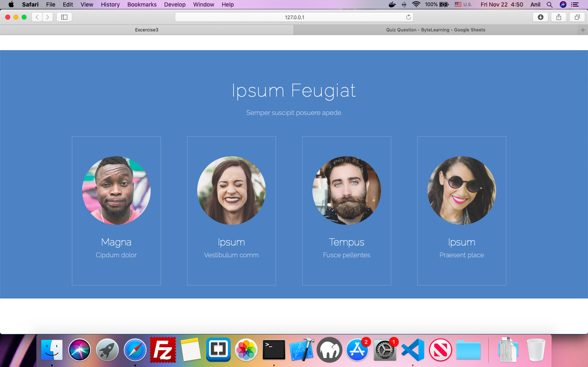

## Exercise-Html-Flex-3

### Objective 
Purpose of this assignment is to improve your web designing skills and use flex layout to create good looking and interactive  web pages.
In order to meet this objective you are suggested to create a one page website to display profile  dashboard of a company top management , using Html 5 Elemments and CSS.

### AESTHETICS:
The intent behind following these aesthetics is to make the web page more visually appealing.

1. Create a page to display profile dashboard of a company top management.
2. There should be a Company Title and Profile Title (eg.Our executive Directors)
3. Below that,  Profile Details each employee in a row.
4. Each profile will contain an image Name and Designation of employee in linear manner.
5. There should be a border for each profile and details should be centre  aligned.
 
### CODING GUIDELINES:

 - The project repository must have a README.md describing about the project being done.
 - The project is suggested to have a descriptive folder structure.
 - The HTML code should adhere to W3C guidelines. Tags are closed, required attributes used, nothing deprecated, etc.
 - Use HTML 5 semantic elements(eg.main,section,header,footer etc)wherever possible.
 - The code should make use of Meta Tags in narrating additional information like author and description of the page.
 - Comments should be included for things that may not be immediately obvious upon reviewing the code.
 - Two Space indentation must be followed while coding your page.
 - Usage of classes for elements which needs similar styling must be maximized.
 - All tags and class names must be in lowercase only.
 - Usage of Inline CSS must be eliminated.
 - Usage of External Stylesheet is recommended.
## Sample Page For Your Reference

## MENTORS TO BEGIN REVIEW YOUR WORK ONLY AFTER ->

<kbd>⌘</kbd> You add the respective Mentor as a Reporter into your Assignment Repository

### REFERENCES:

<kbd>⇥</kbd> https://www.w3.org/Style/Examples/011/firstcss.en.html  
<kbd>⇥</kbd> https://www.w3schools.com/html

### NOTE:
Avoid using any third-party plugins.
