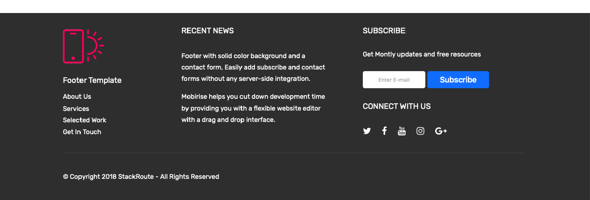

## Exercise-Html-Flex-4

### Objective 
Purpose of this assignment is to improve your web designing skills and use flex layout to create good looking and interactive  web pages.
In order to meet this objective you are suggested to design a footer for web app ,using Html 5  and CSS.

### AESTHETICS:
The intent behind following these aesthetics is to make the web page more visually appealing.

1. The footer should have three sections arranged in row.
2. First Section  should have company logo followed by links to some menu items (eg.About Us,Services, Selected Work, get In Touch) in linear manner.
3. Second section can contain recent important news or achievement about the company.
4. Third section will contain contact links and social icons .
5. All content inside section should be centre aligned.
 
### CODING GUIDELINES:

 - The project repository must have a README.md describing about the project being done.
 - The project is suggested to have a descriptive folder structure.
 - The HTML code should adhere to W3C guidelines. Tags are closed, required attributes used, nothing deprecated, etc.
 - The code should make use of Meta Tags in narrating additional information like author and description of the page.
 - Comments should be included for things that may not be immediately obvious upon reviewing the code.
 - Two Space indentation must be followed while coding your page.
 - All tags classnames must be in lowercase only.
 - Usage of classes for elements which needs similar styling must be maximized.
 - Usage of Inline CSS must be eliminated.
 - Usage of External Stylesheet is recommended.
## Sample Page For Your Reference

## MENTORS TO BEGIN REVIEW YOUR WORK ONLY AFTER ->

<kbd>⌘</kbd> You add the respective Mentor as a Reporter into your Assignment Repository

### REFERENCES:

<kbd>⇥</kbd> https://www.w3.org/Style/Examples/011/firstcss.en.html  
<kbd>⇥</kbd> https://www.w3schools.com/html

### NOTE:
Avoid using any third-party plugins.
